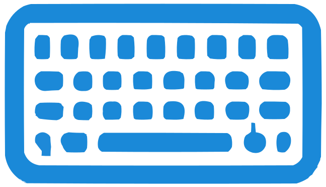

# KeyboardKombat



KeyboardKombat is a fun, real-time, multiplayer typing game that helps users improve their typing speed and accuracy. Built using the MERN stack (MongoDB, Express, React, and Node.js), the game also incorporates Socket.IO for seamless real-time communication between players.

## Table of Contents

1. [Features](#features)
2. [Installation](#installation)
3. [Usage](#usage)
4. [License](#license)

## Features

- Real-time multiplayer experience
- Leaderboard showcasing the top players
- Typing statistics tracking
- Responsive design

## Installation

Before you begin, ensure you have the following software installed on your machine:

- Node.js (v14 or newer)
- MongoDB (v4.4 or newer)

Clone this repository and navigate to the project directory:

```bash
git clone https://github.com/alis-SWE/KeyboardKombat.git
cd keyboardkombat
```

Build the server-side and start the server:

```bash
cd server
npm install
npm run dev
```

Build the client-side React application:

```bash
cd client
npm install
npm start
cd ..
```

The server will start running at **'http://localhost:3000'**. Open your web browser and visit this URL to start playing!

## Usage

1. Click 'Create Kombat' or 'Join Kombat' if you have a code.
2. Create a game or join a game using a code.
3. Start the game and compete against other players to be the fastest typist!
4. View your progress on the leaderboard and improve your skills.


## License

KeyboardKombat is released under the MIT License.
